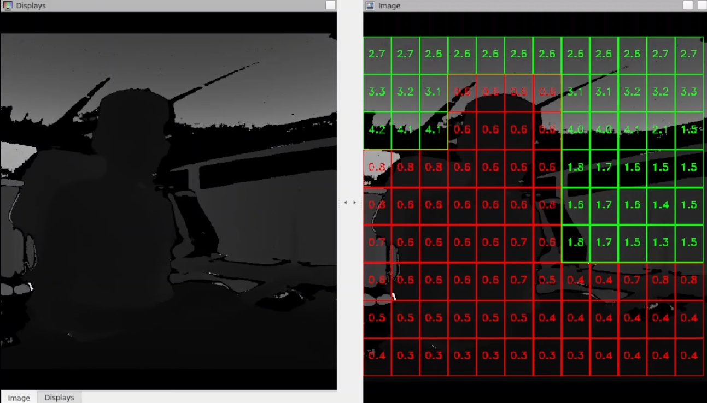

<h1 style="text-align: center;" > Depth Obstacle Detection ROS</h1>

# Overview
The **Depth Obstacle Detection ROS** package for the Robot Operating System (ROS) identifies surfaces near the depth camera within a specified threshold. The image is divided into a grid of multiple cells, and the minimum value in each cell is detected. Values below the threshold are highlighted in red to indicate the presence of an obstacle. There are two packages in this installation, the core package `depth_obstacle_detect_ros` which is dependant on `depth_obstacle_detect_ros_msgs`.


[](http://wiki.ros.org/noetic) [](https://releases.ubuntu.com/focal/) [](./LICENSE) 

> [!NOTE]  
> This node requires a custom ros message package to be installed in the same workspace. It can be found [here.](./depth_obstacle_detect_ros_msgs)  

# Background
The obstacle detection node subscribes to `/tof_cam/rect/depth` by default. The launch file can be edited to make the node subscribe to a topic that publishes depth images from a depth camera. Image encoding with `mono16` or `16UC1` are supported by the node. The node divides an image into a grid of specified number of cells vertically and horizontally. The minimum value of each cell is taken into account to decide if there is an obstacle within the range specified by the threshold. The [depth_obstacle_detect_ros_msgs](depth_obstacle_detect_ros_msgs/README.md) is used to publish obstacle information for any external use.

# Hardware
 - Any Depth Camera, such as [EVAL-ADTF3175D-NXZ](https://www.analog.com/en/resources/evaluation-hardware-and-software/evaluation-boards-kits/eval-adtf3175.html) Module
 - A Desktop with Ubuntu 20.04LTS, preferably with x86_64 architecture.

# Setting up topics
## Update Topic Names
Ensure that the topic names in the `launch/depth_obstacle_detect_ros.launch` match the corresponding topics in your ROS environment. For example, if your topic in which depth images are published is called `camera/depth` then the corresponding parameter line becomes:
```xml
<!-- Orignal Line -->
<param name="depth_topic" type="string" value="depth_image"/>

<!-- Modified Line -->
<param name="depth_topic" type="string" value="camera/depth"/>
```
Note that `camera` isn't the namespace. To add a namespace check [here](#set-namespace).

## Set Namespace
Define the desired namespace by setting the `ns_prefix` field. In `launch/depth_obstacle_detect_ros.launch` edit the line as follows:

```xml
<!-- Original line -->
<arg name="ns_prefix" default="cam1" />

<!-- Modified Line -->
 <arg name="ns_prefix" default="robot" />
```
Hence the resulting topic name, with respect to the previous heading would become `/robot/camera/depth`

## Edit Parameters
Modify the parameters in the launch file as needed to suit your specific requirements. Suppose you wish to have a different number of segments vertically and horizontally, edit the `width_regions` and `height_regions` parameters.

```xml
<param name="width_regions" type="int" value="15" />
<param name="height_regions" type="int" value="20" />
```
More details on existing parameters are mentioned [below](#parameters).

> [!NOTE]  
> The above mentioned changes can also similarly be applied to `launch/depth_obstacle_detect_ros_nodelet.launch` for the nodelet.

## Parameters
|Parameter Field|Type|Description|
|:---|:---:|---:|
|obstacle_range_limit|double|Detection Distance in meters|
|width_regions|int|Number of segments horizontally|
|height_regions|int|Number of segments vertically|
|depth_topic|string|Topic where depth images are published|
|camera_info_topic|string|Topic where camera information is published|
|detect_topic|string|Topic where images marking obstacles are published|
|obstacle_state_topic|string|Topic where obstacle detection true or false grid is published|
|cam_id|string|Camera ID for message Header information|
|verbose|bool|Output debug information|


# Launch Commands
The obstacle detection node can be run using
`roslaunch depth_obstacle_detect_ros depth_obstacle_detect_ros.launch` 

A nodelet of the detection node can be run using
`roslaunch depth_obstacle_detect_ros depth_obstacle_detect_ros_nodelet.launch`

In order to load the nodelet into a nodelet manager, use:
`rosrun nodelet nodelet load obstacle_detect/Obstacle_Detect manager`
> [!NOTE]  
> In case bond broken error arises, use `--no-bond` flag.

## Outputs

### Obstacle Detection output
